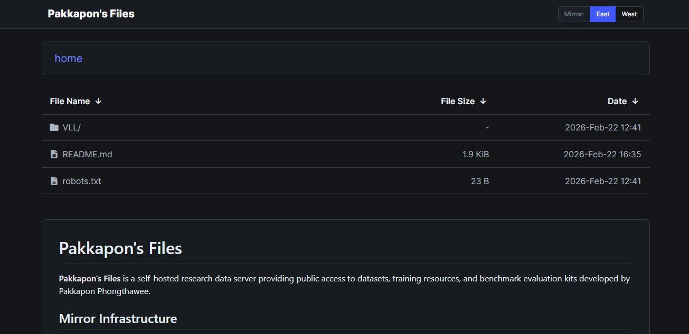

# FancyIndex Research Theme



A modern dark-themed UI for the NGINX `ngx_http_fancyindex_module`, designed for hosting research datasets, benchmarks, and public file repositories.

This theme enhances the default FancyIndex experience with automatic documentation preview and built-in multi-mirror support.

🔗 **Live Example:**  
- https://east.ph.in.th/
- https://west.ph.in.th/


## ✨ Features

### 📄 Automatic README Preview

If a `README.md` file exists in the current directory, it is automatically rendered and displayed below the file list.

This allows each directory to function as a self-documenting dataset or project page without requiring a separate web framework.


### 🔁 Multi-Mirror Support

Built-in mirror switching with a toggle button located at the top-right corner.

- Seamless switching between mirrors  
- No path rewriting required  
- Designed for self-hosted infrastructure redundancy  

Mirror configuration is handled via the `mirror.json` file included in the theme directory.  
Please refer to `mirror.json` for configuration details.


## 🎨 Design Goals

- Minimal and distraction-free layout  
- Dark theme optimized for long reading sessions  
- Clean file metadata display (name, size, date)  
- Lightweight (no heavy frontend framework)  

No database.  
No backend dependency.  
Just NGINX + static assets.


## 📦 Requirements

- NGINX  
- `ngx_http_fancyindex_module`  


## ⚙️ Installation

### 1. Clone Theme

Clone this repository into a hidden directory named:

```
/.fancyindex/
```

Example:

```bash
git clone https://github.com/pureexe/fancyindex.git /var/www/html/.fancyindex
```

> The directory must be named `.fancyindex` (with a leading dot).


### 2. Configure NGINX

Enable FancyIndex and configure custom header/footer:

```nginx
location / {
    fancyindex on;
    fancyindex_localtime on;
    fancyindex_exact_size off;

    fancyindex_header "/.fancyindex/header.html";
    fancyindex_footer "/.fancyindex/footer.html";

    fancyindex_ignore ".fancyindex";
}
```

The following line ensures the theme directory is not exposed in directory listings:

```nginx
fancyindex_ignore ".fancyindex";
```


### 3. Enable Mirror Configuration (Optional)

Place and configure the `mirror.json` file inside:

```
/.fancyindex/mirror.json
```

The theme will automatically load this file and display the mirror toggle accordingly.


## 🧠 Intended Use Cases

- Research dataset hosting  
- Academic benchmark distribution  
- Public supplementary material pages  
- Self-hosted file mirrors  
- Lab infrastructure nodes  


## 📄 License

MIT License


## 👤 Author

Pakkapon Phongthawee  
GitHub: https://github.com/pureexe  

---

If you use this theme in your research infrastructure, a ⭐ on the repository is appreciated.